## End-user observation

## Use Cases

**Title: Register New User  
Actor: Customer**

Scenario: Customer signs up and provides name, location, interest, current work, password, email. System checks validity of all information provided, if valid will allow customer to sign up. System will store user data for future login. If not valid system will show error that is not allowing the customer to sign up. Customer will fix errors and system will again check for validity.  

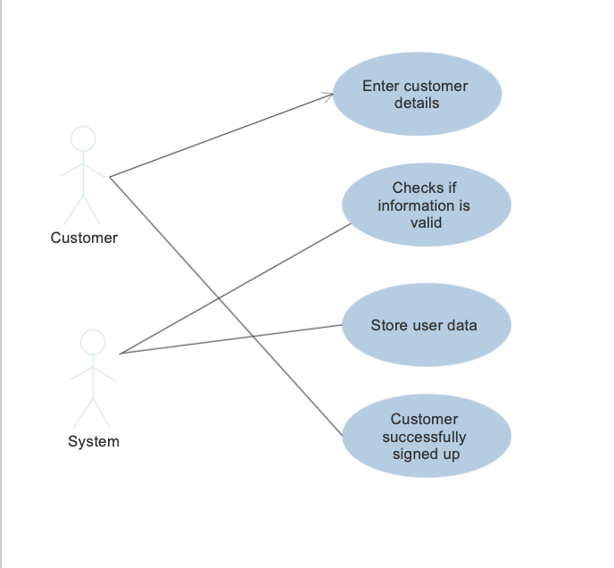

**Title: User Login  
Actor: Customer**

Scenario: Customer will enter email and password for login and will click the login button. System checks if email and password pair exist in system. If it does user will then be able to proceed and use the app. If not system shows error message prompting customer to enter valid email and password. 
 

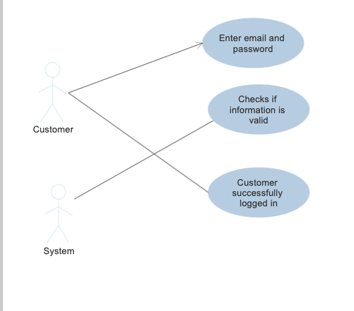

**Title: Switching between job and networking view  
Actor: Customer**

Scenario: After the customer has logged in, the customer will have the option to either select job search or networking. The system will then modify the view based on the option that customer has selected.  

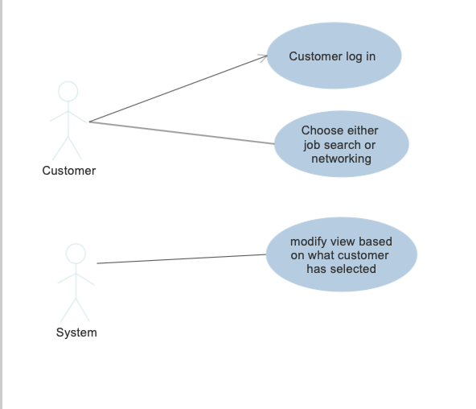

**Title: Finding a match  
Actor: Customer**

Scenario: Customer has logged in, if not modified, system will use customer’s current location and customer’s interest to generate matches. If customer modifies location and/or disables permission for location, system will generate matches based on modified location and customer’s interest.  

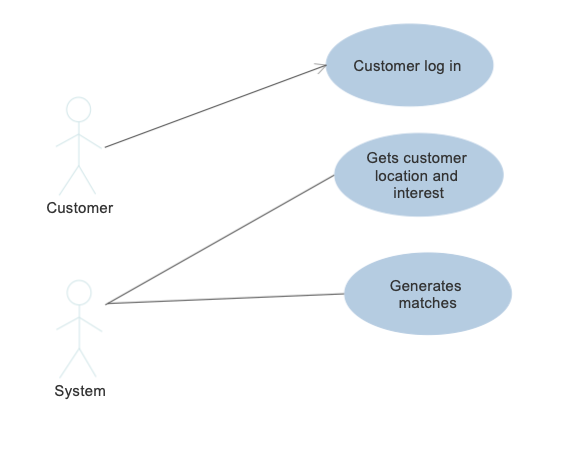

**Title: Getting a match (networking) 
Actor: Customer**

Scenario: System will present multiple matches for customer to choose from displaying details about the matches including name, job, location. If customer finds a match that they like they can choose to connect. System will send a notification to the match requesting for a connection. If the match also agrees to connect then customer will be able to chat with match.  

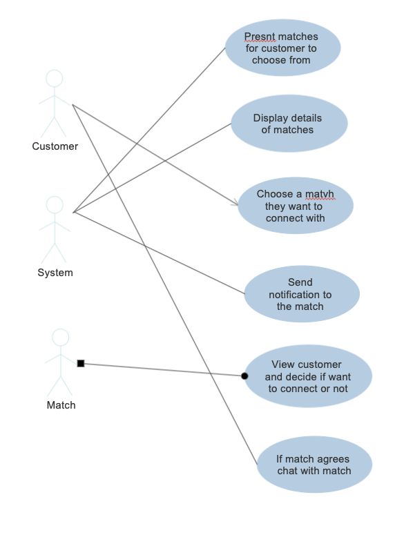

**Title: Messaging Others (networking) 
Actor: Customer**

Scenario: After the customer has connected with the match, the customer will be able to click the message button where the customer will then be brought to the chat room and the users will be able to chat with the match.  

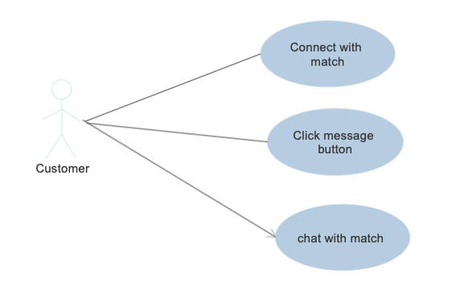

**Title: Getting a match (job search)  
Actor: Customer**

Scenario: System will present multiple open jobs for customers to choose from based on their interest and location. If customer finds a job that they are interested in then and they meet the criteria, then they can apply to the job.  

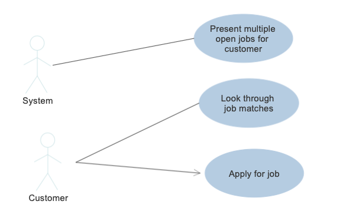

**Title: Applying to job  
Actor: Customer**

Scenario: Once the customer chooses to apply to a job then they will be brought to a forms page where they can fill out their details. The system will not allow the customer to submit their application until they have filled in all the required field and attached all the required documents. After doing so the user can then press the submit button.  

**Title: Edit profile/ settings  
Actor: Customer**

Scenario: At the home page the customer will have a settings button, when it is clicked the customer will be brought to the profile where they will be able to edit their profile (name, location, work, password) and add or edit the documents that they have. Once they are finished with their edits the customer can press the save button and the system will modify the customers data to reflect the changes that they made.  

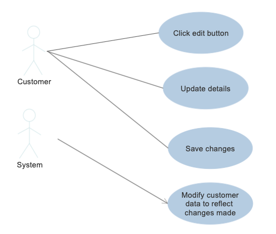

**Title: Company Signup  
Actor: Company**

Scenario: Companies will signup by entering their company name, email, password and their current open job, basic requirements that they have to filter out ideal candidates and location of jobs. Once the company presses the sign up button, the system will verify if the inputs are valid (valid email and password). If valid then the company will have successfully signed up but if not then there will be an error message saying what was wrong.  

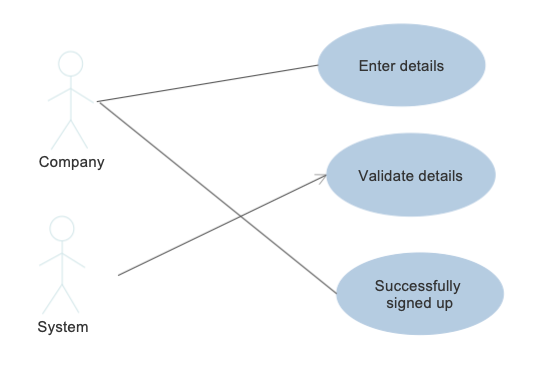

**Title: Getting Applicants  
Actor: Company**

Scenario: Once the companies log in the application will display all the weeks starting from when they signed up (bottom) upto the current week (top). The companies will be able to click on the dates which will expand to show all the applicants that week. Before displaying the system will sort the applicants based on how well they meet the company’s requirements. If the applicant does not meet a certain threshold their name will not show up on the list. Once the companies click on the name, the applicant’s details will show up.  

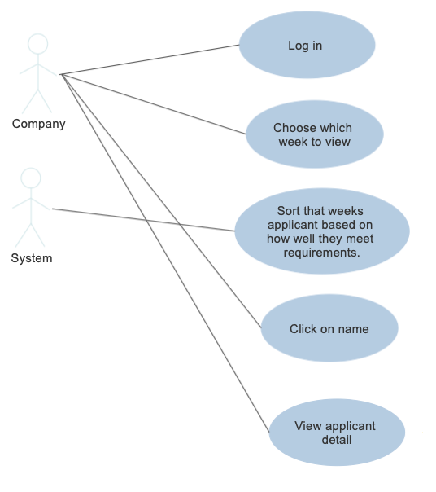

**Title: Edit profile/ settings  
Actor: Company**

Scenario: Companies will be able to edit their profile such as adding new job positions or removing filled positions. Once they have saved the new details the system will update the company’s data to reflect the new changes.  

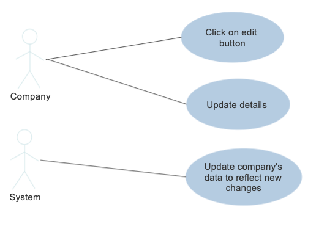

## Domain Model

